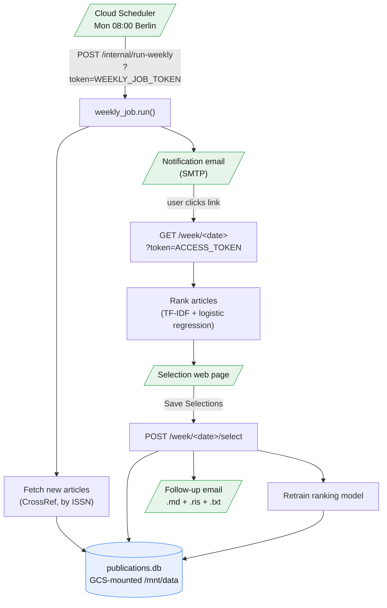

# publication-reports

The goal of publication-reports is to more easily track new articles across a personal list of journals. Each Monday the job fetches new publications from a configured journal list, emails a short notification with a link, and shows a web page where the reader ticks the articles worth reading. A follow-up email delivers those selections as a readable list plus Zotero import files, and the selections themselves become training data. A TF-IDF and logistic regression model, seeded from a set of pre-labelled articles and retrained on every run, reorders future weeks so the most relevant articles surface first, using the same active-learning logic as systematic-review tools like ASReview.

## Data flow



## Layout

```
scripts/app.py              Flask app: selection page, weekly job trigger route
scripts/weekly_job.py       fetches new publications, sends the notification email
scripts/grabber.py          CrossRef fetch logic
scripts/ranker.py           TF-IDF + logistic regression ranking model
scripts/db.py               SQLite schema and data access
scripts/emailer.py          notification and selection emails
info/journal-info-comb.csv  the journal list (group, name, ISSN, include flag)
model/data/                 pre-labelled seed articles for the ranker
Dockerfile                  gunicorn image
deploy.sh                   one-shot standalone deploy script
gcloud_app.yaml             manifest read by a shared ../manage.py gcloud servier orchestrator
env.yaml.example            committed template; env.yaml is gitignored
```

## Setup

```bash
gcloud auth login
gcloud config set project YOUR_PROJECT
gcloud services enable run.googleapis.com cloudbuild.googleapis.com \
  cloudscheduler.googleapis.com storage.googleapis.com
gcloud storage buckets create gs://YOUR_PROJECT-pubrep-data --location=europe-west1 --labels=app=pub-reports
```

Copy `env.yaml.example` to `env.yaml` and fill in SMTP settings (a personal Gmail address with a 2FA App Password, not a Workspace account) plus three random tokens generated with `python -c "import secrets; print(secrets.token_hex(32))"` for `SECRET_KEY`, `ACCESS_TOKEN`, and `WEEKLY_JOB_TOKEN`. Leave `BASE_URL` as the placeholder until after the first deploy.

Deploy, then paste the printed service URL into `env.yaml` as `BASE_URL` and deploy again so the service knows its own address:

```bash
bash deploy.sh
```

`deploy.sh` prints the service URL and, once `WEEKLY_JOB_TOKEN` is set at the top of the script, creates the Cloud Scheduler trigger on the second run.

Verify with:

```bash
gcloud scheduler jobs run pubrep-weekly-sched --location=europe-west1
```

## Commands

| Action | Command |
|---|---|
| Deploy or update the service | `bash deploy.sh` |
| Deploy via the shared orchestrator | `python ../manage.py` |
| Trigger the weekly job manually | `gcloud scheduler jobs run pubrep-weekly-sched --location=europe-west1` |
| Tail logs | `gcloud run services logs tail pubrep --region=europe-west1` |
| Download the database | `gcloud storage cp gs://YOUR_PROJECT-pubrep-data/publications.db ./publications.db` |
| Update env vars only (no rebuild) | `gcloud run services update pubrep --region=europe-west1 --env-vars-file=env.yaml` |
| Delete the service, scheduler, and bucket | `gcloud run services delete pubrep --region=europe-west1` |

## Operations

**Redeploy after a code or settings change** runs `bash deploy.sh` again; Cloud Run replaces the running revision in place with no separate stop step.

**Adding or removing journals.** Edit `info/journal-info-comb.csv` in a spreadsheet application: `group` is the section heading, `name` the display name, `o-issn` the ISSN CrossRef is queried against, and `crossref` set to `T` to include the row in the weekly fetch. Redeploy after editing so the new image ships the updated file.

**Inspecting the database.** Download it with the command above and open it in DB Browser for SQLite; it holds articles, selection history, and the training data the ranker retrains on.

**Common failures.**

- Selection page or job trigger returns an error: tail the logs while retriggering to see the traceback.
- Monday email never arrives: run the scheduler job manually and watch the logs; the most common cause is an incorrect `SMTP_PASS` (must be the 16-character App Password, no spaces) or a non-Gmail `SMTP_USER`.
- Everything needs a clean restart: delete the service, scheduler job, and bucket with the commands above, then redo Setup from the bucket-creation step.

## Cost

| Resource | Schedule | Monthly |
|---|---|---|
| Cloud Run compute | a few minutes weekly | a few cents |
| Cloud Storage | a few MB | a fraction of a cent |
| Cloud Scheduler (1 job) | weekly | ~$0.10 |
| Cloud Build (on redeploy) | on deploy | a few cents |
| **Total** | | **well under $1/month** |

> Estimates only, verify current pricing in the Google Cloud console before relying on them. Set a budget alert (Billing → Budgets & alerts) as a hard safety limit.
